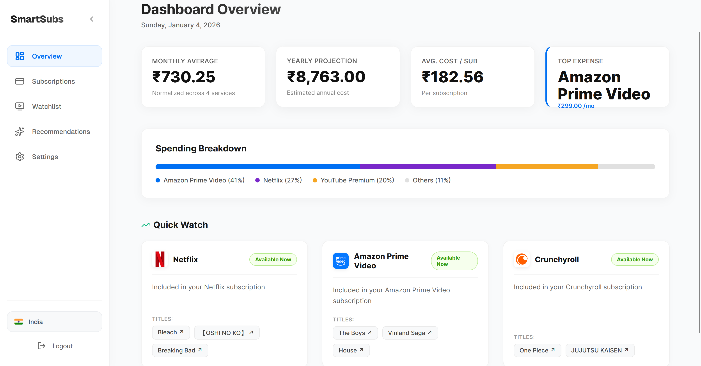
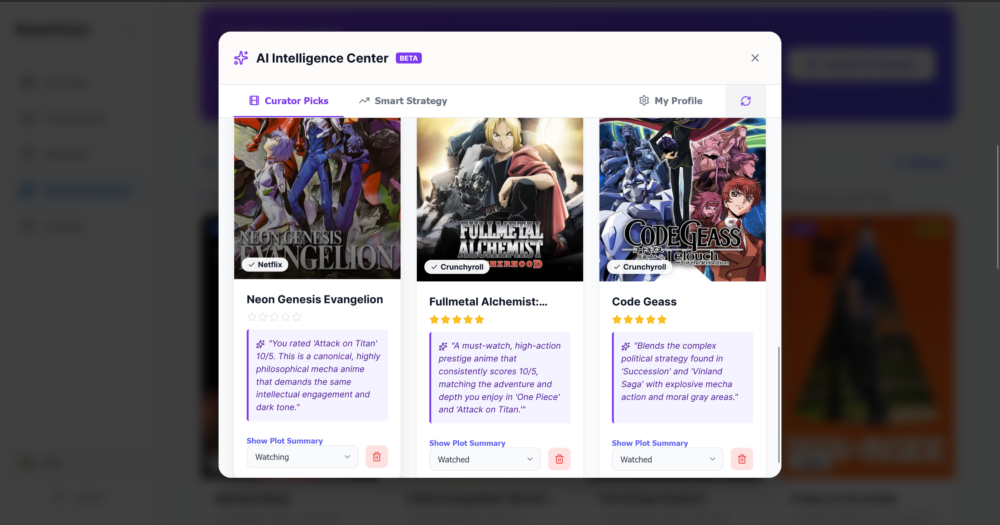
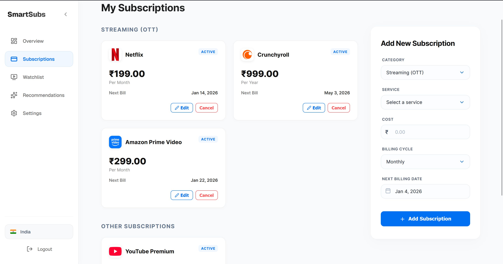
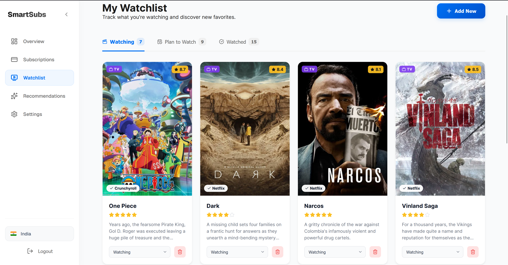

# 💎 Smart Subscription Manager

**AI-Powered Optimization for Your Streaming Life.**



Stop wasting money on unused subscriptions. Subscription Manager helps you track your spending, discover what to watch on the services you already own, and uses AI to optimize your streaming portfolio.

## ✨ Key Features

- 🧠 **AI Intelligence (Powered by Gemini)**
  
  - **Quality Recommendations**: Discover hidden gems tailored to your watchlist and personal profile.
  - **Smart Strategy**: Get personalized advice on which services to keep, cancel, or rotate based on your viewing habits.
  - **Gap Analysis**: Find out what you're missing based on your interests.

- 📊 **Smart Dashboard**
  
  - **Visual Spending**: Beautiful breakdown of your monthly and yearly streaming costs.
  - **Usage Tracking**: Identify "Zombie Subscriptions" you haven't used in months.

- 📺 **Unified Watchlist**
  
  - **One List, All Services**: Track movies and TV shows across Netflix, Hulu, Prime, and more.
  - **Availability Badges**: Instantly see which of your *active* subscriptions has the content.

- 🔐 **Secure Authentication**
  - Robust Signup & Login flow with secure session management.

## 🛠️ Tech Stack

### Frontend
- **Framework**: Next.js 14 (App Router)
- **Language**: TypeScript
- **Styling**: Vanilla CSS Modules (Custom Glassmorphism Design System)
- **Icons**: Lucide React

### Backend
- **Framework**: FastAPI
- **ORM**: SQLAlchemy
- **Database**: SQLite (Dev) / Postgres (Prod ready)
- **Validation**: Pydantic

## 🚀 Getting Started

### Prerequisites
- Node.js 18+
- Python 3.10+

### 1. Backend Setup

```bash
cd backend
python -m venv venv
# Windows
venv\Scripts\activate
# Mac/Linux
source venv/bin/activate

pip install -r requirements.txt
```

**Environment Variables (`backend/.env`)**:
Create a `.env` file in the `backend` directory:
```env
DATABASE_URL=sqlite:///./sql_app.db
SECRET_KEY=your_super_secret_key_here
ALGORITHM=HS256
ACCESS_TOKEN_EXPIRE_MINUTES=30
TMDB_API_KEY=your_tmdb_api_key
GEMINI_API_KEY=your_google_gemini_api_key
```

**Run Server**:
```bash
uvicorn main:app --reload --port 8000
```

### 2. Frontend Setup

```bash
cd frontend
npm install
```

**Environment Variables (`frontend/.env.local`)**:
Create a `.env.local` file in the `frontend` directory:
```env
NEXT_PUBLIC_API_URL=http://localhost:8000
```

**Run App**:
```bash
npm run dev
```

Visit `http://localhost:3000` to start optimizing!
