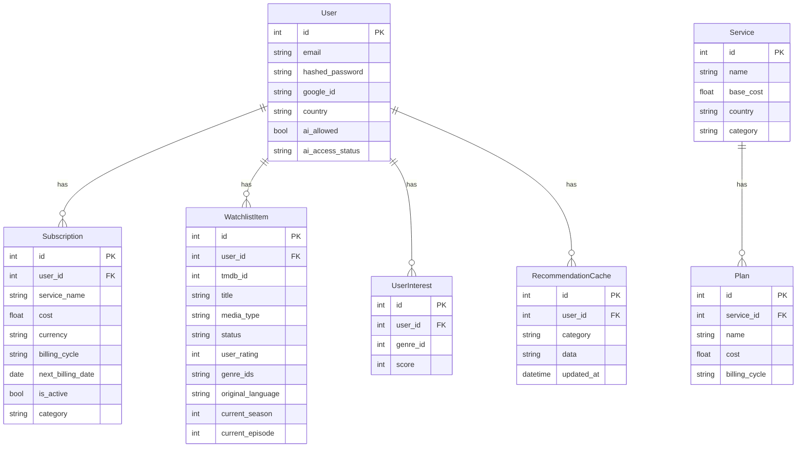

# SmartSubs — Project Architecture & Documentation

A comprehensive guide to the SmartSubs codebase. This document covers the full-stack architecture, every backend module, every frontend component, and how they all connect.

---

## Table of Contents

1. [Overview](#overview)
2. [Tech Stack](#tech-stack)
3. [Project Structure](#project-structure)
4. [Backend Architecture](#backend-architecture)
5. [Frontend Architecture](#frontend-architecture)
6. [Data Flow](#data-flow)
7. [External APIs](#external-apis)
8. [Environment Variables](#environment-variables)

---

## Overview

SmartSubs is a **subscription management + watchlist tracking** app. Users can:

- **Track subscriptions** (Netflix, Spotify, etc.) with cost/billing info
- **Manage a watchlist** of movies/TV shows (via TMDB) with ratings, progress, and status
- **Get recommendations** — trending content, similar titles, and content discovery
- **AI-powered insights** — personalized picks, savings strategy, and content gap analysis (via Gemini)
- **Report bugs** — in-app issue reporting that creates GitHub Issues

---

## Tech Stack

| Layer | Technology |
|-------|------------|
| **Frontend** | Next.js (React), TypeScript, CSS Modules |
| **Backend** | FastAPI (Python), SQLAlchemy ORM |
| **Database** | PostgreSQL (Neon on prod), SQLite (local dev) |
| **AI** | Google Gemini 1.5 Flash (REST API) |
| **Media Data** | TMDB API (movies, TV, providers) |
| **Auth** | JWT tokens + Google OAuth 2.0 |
| **Hosting** | Vercel (frontend), Render (backend) |
| **Bug Reports** | GitHub Issues API |

---

## Project Structure

```
Subscription-manager/
├── backend/                   # FastAPI Python backend
│   ├── main.py                # All API endpoints (~1040 lines)
│   ├── models.py              # SQLAlchemy database models
│   ├── schemas.py             # Pydantic request/response schemas
│   ├── crud.py                # Database operations (create, read, update, delete)
│   ├── config.py              # Environment config (Settings class)
│   ├── database.py            # DB connection & session setup
│   ├── dependencies.py        # Auth dependency (get_current_user)
│   ├── security.py            # Password hashing & JWT token creation
│   ├── recommendations.py     # Recommendation engine (trending, similar, discovery)
│   ├── ai_client.py           # Gemini AI integration (unified insights)
│   ├── tmdb_client.py         # TMDB API wrapper (search, providers, details)
│   ├── email_client.py        # Email sending (password reset)
│   ├── logger.py              # Rotating file logger
│   ├── migration.py           # Database migration script
│   ├── routers/
│   │   └── auth.py            # Google OAuth login/callback routes
│   ├── scripts/               # Utility scripts (backfills, debug, cache reset)
│   └── requirements.txt       # Python dependencies
│
├── frontend/                  # Next.js React frontend
│   └── src/
│       ├── app/               # Pages (Next.js App Router)
│       │   ├── page.tsx       # Landing page (/)
│       │   ├── login/         # Login page
│       │   ├── signup/        # Signup page
│       │   ├── welcome/       # Onboarding page
│       │   ├── search/        # TMDB search page
│       │   ├── profile/       # User profile & settings
│       │   └── dashboard/     # Main app (authed)
│       │       ├── page.tsx           # Dashboard home (stats, spending)
│       │       ├── layout.tsx         # Dashboard layout (sidebar)
│       │       ├── subscriptions/     # Subscription manager page
│       │       ├── watchlist/         # Watchlist page
│       │       └── recommendations/   # Recommendations page
│       ├── components/        # Reusable React components
│       ├── context/           # React contexts (Theme, Recommendations)
│       └── lib/               # Utilities (API client, types, genres, currency)
│
├── docs/                      # Documentation
├── ROADMAP.md                 # Feature roadmap
├── CHANGELOG.md               # Version history
└── .gitignore
```

---

## Backend Architecture

### Database Models (`models.py`)



**Key models explained:**

| Model | Purpose |
|-------|---------|
| `User` | User account with email/password or Google OAuth, country preference, AI access controls |
| `Subscription` | A user's streaming subscription (e.g., Netflix $15.49/monthly) |
| `WatchlistItem` | A movie/TV show on user's watchlist with status, rating, and watch progress |
| `UserInterest` | Genre preference scores (auto-updated when user rates/adds content) |
| `Service` | Available streaming services with pricing per country |
| `Plan` | Specific plans for a service (Basic, Standard, Premium) |
| `RecommendationCache` | Cached recommendation data (refreshed every 24 hours) |

---

### API Endpoints (`main.py`)

All endpoints are in `main.py` (~1040 lines). Here's a grouped overview:

#### Auth & Users
| Method | Path | Description |
|--------|------|-------------|
| `POST` | `/signup` | Register with email/password |
| `POST` | `/token` | Login, returns JWT token |
| `GET` | `/users/me` | Get current user info |
| `PUT` | `/users/me/profile` | Update profile (country, password, etc.) |
| `PUT` | `/users/me/preferences` | Update AI preferences |
| `POST` | `/users/me/request-ai` | Request AI access |

#### Subscriptions
| Method | Path | Description |
|--------|------|-------------|
| `POST` | `/subscriptions` | Add a subscription |
| `GET` | `/subscriptions` | List user's subscriptions |
| `PUT` | `/subscriptions/{id}` | Update a subscription |
| `DELETE` | `/subscriptions/{id}` | Delete a subscription |

#### Watchlist
| Method | Path | Description |
|--------|------|-------------|
| `POST` | `/watchlist` | Add item to watchlist |
| `GET` | `/watchlist` | Get user's watchlist |
| `DELETE` | `/watchlist/{id}` | Remove from watchlist |
| `PATCH` | `/watchlist/{id}/status` | Update status (plan_to_watch → watching → watched) |
| `PATCH` | `/watchlist/{id}/rating` | Rate an item (1-10) |
| `PATCH` | `/watchlist/{id}/progress` | Update season/episode progress |
| `POST` | `/watchlist/check-availability` | Check which services stream watchlist items |

#### Recommendations
| Method | Path | Description |
|--------|------|-------------|
| `GET` | `/recommendations` | Legacy fast recommendations |
| `GET` | `/recommendations/dashboard` | Dashboard recs (Watch Now, Cancel suggestions) |
| `GET` | `/recommendations/similar` | Similar content recs |
| `POST` | `/recommendations/refresh` | Force refresh recommendation cache |

#### AI Intelligence
| Method | Path | Description |
|--------|------|-------------|
| `GET` | `/recommendations/insights` | AI-powered unified insights (picks, strategy, gaps) |

#### Services & Providers
| Method | Path | Description |
|--------|------|-------------|
| `GET` | `/services` | List available streaming services |
| `GET` | `/services/{id}/plans` | Get plans for a service |
| `GET` | `/media/{type}/{id}/providers` | Get streaming providers for media |
| `GET` | `/media/{type}/{id}/details` | Get full TMDB details for media |

#### Other
| Method | Path | Description |
|--------|------|-------------|
| `GET` | `/search?query=...` | Search TMDB for movies/TV |
| `GET` | `/stats` | User subscription stats |
| `GET` | `/spending` | Monthly spending breakdown |
| `POST` | `/feedback/report` | Report bug/request feature (→ GitHub Issue) |

#### Google OAuth (`routers/auth.py`)
| Method | Path | Description |
|--------|------|-------------|
| `GET` | `/auth/login/google` | Redirect to Google login |
| `GET` | `/auth/callback/google` | Handle OAuth callback, create/link user |

#### Admin Panel
The backend includes **SQLAdmin** panel at `/admin` for managing users, subscriptions, and watchlist items directly.

---

### Backend Modules Explained

#### `crud.py` — Database Operations
All database read/write logic. Key functions:
- `create_user`, `get_user_by_email` — User management
- `create_user_subscription`, `get_user_subscriptions` — Subscription CRUD
- `create_watchlist_item` — Adds item + fetches TMDB metadata (genres, poster, language)
- `update_interests` — Auto-adjusts genre preference scores when items are added/rated
- `update_watchlist_item_rating` — Updates rating + adjusts genre scores based on rating

#### `recommendations.py` — Recommendation Engine
Generates personalized content recommendations. Two calculation paths:

1. **Dashboard recs** (`calculate_dashboard_recommendations`):
   - **Watch Now** — Watchlist items available on user's active subscriptions
   - **Cancel** — Subscriptions with no watchlist content
   - **Subscribe** — Services with content user wants to watch
   - **Trending** — Popular items on TMDB, filtered to user's interests
   - **Explore** — Genre-based discovery using TMDB discover endpoint

2. **Similar content** (`calculate_similar_content`):
   - **You Might Like** — Similar titles based on user's highly-rated watchlist items
   - **Curator Picks** — Curated based on top genre interests
   - **Missing Out** — Content on services user already pays for

**Caching:** Uses `RecommendationCache` table. Data is cached for 24 hours and refreshed in background tasks.

#### `ai_client.py` — AI Integration (Gemini)
Calls Google Gemini 1.5 Flash via REST API. Generates:
- **AI Picks** — Personalized recommendations with reasons
- **Strategy** — Cost-saving advice (keep/cancel/switch subscriptions)
- **Gaps** — Content user is missing that matches their taste

Requires admin-approved AI access (`ai_allowed=True` on User model).

#### `tmdb_client.py` — TMDB API Client
Wrapper for The Movie Database API:
- `search_multi(query)` — Search movies + TV shows
- `get_watch_providers(type, id)` — Which services stream a title (cached with `lru_cache`)
- `get_similar(type, id)` — Similar titles
- `get_details(type, id)` — Full metadata (genres, runtime, etc.)
- `discover_media(...)` — Browse by genre, popularity, provider

#### `security.py` — Auth Helpers
- `hash_password(password)` — Bcrypt hashing
- `verify_password(plain, hashed)` — Password verification
- `create_access_token(data)` — JWT token generation

#### `dependencies.py` — Auth Middleware
- `get_current_user(token)` — Decodes JWT, returns current User from DB

#### `logger.py` — Logging
Rotating file logger that writes to `logs/smartsubs.log` (5 MB max, 3 backups).

---

## Frontend Architecture

### Pages (App Router)

| Route | File | Description |
|-------|------|-------------|
| `/` | `app/page.tsx` | Landing page — hero, features, CTA |
| `/login` | `app/login/page.tsx` | Email/password + Google login |
| `/signup` | `app/signup/page.tsx` | Registration form |
| `/welcome` | `app/welcome/page.tsx` | Onboarding (set country, add first subs) |
| `/search` | `app/search/page.tsx` | TMDB search to add to watchlist |
| `/profile` | `app/profile/page.tsx` | Profile settings, report issues |
| `/dashboard` | `app/dashboard/page.tsx` | **Main dashboard** — stats cards, spending chart |
| `/dashboard/subscriptions` | Subscription list with add/edit/delete |
| `/dashboard/watchlist` | Watchlist with filters (Movie/TV/Anime), ratings, progress |
| `/dashboard/recommendations` | Recommendations: Trending, You Might Like, Curator Picks |

### Components

| Component | File | Purpose |
|-----------|------|---------|
| `Sidebar` | `Sidebar.tsx` | Dashboard navigation sidebar with links |
| `MediaCard` | `MediaCard.tsx` | Card displaying movie/TV poster, rating, badges (Anime ⚡, Available ✓) |
| `MediaDetailsModal` | `MediaDetailsModal.tsx` | Pop-up with full details, streaming providers, rating, progress |
| `AddMediaModal` | `AddMediaModal.tsx` | TMDB search + add to watchlist modal |
| `AIInsightsModal` | `AIInsightsModal.tsx` | AI-powered insights display (picks, strategy, gaps) |
| `ConfirmationModal` | `ConfirmationModal.tsx` | Generic confirm/cancel dialog |
| `ReportIssueModal` | `ReportIssueModal.tsx` | Bug report modal with category, description, screenshots |
| `CustomSelect` | `CustomSelect.tsx` | Styled dropdown component used across the app |
| `StarRating` | `StarRating.tsx` | Interactive 1-5 star rating component |
| `ScrollToTop` | `ScrollToTop.tsx` | Floating scroll-to-top button |
| `ThemeToggle` | `ThemeToggle.tsx` | Light/dark mode toggle |
| `ServiceIcon` | `ServiceIcon.tsx` | Streaming service logo renderer |
| `FeatureCarousel` | `FeatureCarousel.tsx` | Landing page feature showcase carousel |
| `WasteKiller` | `WasteKiller.tsx` | Subscription waste indicator card |
| `AuthRedirect` | `AuthRedirect.tsx` | Redirects to login if unauthenticated |

### Contexts

| Context | File | Purpose |
|---------|------|---------|
| `ThemeContext` | `ThemeContext.tsx` | Light/dark theme state, persists to `localStorage` |
| `RecommendationsContext` | `RecommendationsContext.tsx` | Caches rec data, provides `refreshRecommendations()` across pages |

### Lib (Utilities)

| File | Purpose |
|------|---------|
| `api.ts` | Axios instance with base URL + JWT auth interceptor |
| `types.ts` | TypeScript interfaces (`Subscription`, `WatchlistItem`, `Recommendation`, etc.) |
| `genres.ts` | TMDB genre ID → name mapping |
| `currency.ts` | Currency formatting helpers by country code |

---

## Data Flow

### Adding a Watchlist Item

```
User searches in AddMediaModal
  → TMDB search_multi API call
  → User clicks "Add"
  → POST /watchlist (tmdb_id, title, media_type)
  → crud.create_watchlist_item():
      1. Fetches full details from TMDB (genres, language, poster)
      2. Creates WatchlistItem in DB
      3. Updates UserInterest scores (+1 for each genre)
  → Background: refreshes recommendations cache
  → Frontend updates watchlist list
```

### Recommendation Generation

```
User visits /dashboard/recommendations
  → GET /recommendations/dashboard
  → recommendations.get_dashboard_recommendations():
      1. Check RecommendationCache (< 24 hours old?)
      2. If cached → return immediately
      3. If stale → calculate_dashboard_recommendations():
          a. Get user's subscriptions + watchlist
          b. Check TMDB providers for each watchlist item
          c. Build Watch Now / Cancel / Subscribe recs
          d. Fetch trending from TMDB
          e. Discover based on user genre interests
          f. Cache results in RecommendationCache
  → Frontend renders cards in sections
```

### Bug Reporting

```
User clicks "Report an Issue" on profile
  → ReportIssueModal opens
  → User selects category, writes description, optionally attaches screenshots
  → POST /feedback/report { category, description, screenshots[] }
  → Backend:
      1. Uploads screenshots to .feedback/ in GitHub repo (Contents API)
      2. Creates GitHub Issue with labels + embedded screenshot URLs
  → User sees success with issue number
```

---

## External APIs

| API | Usage | Key Config |
|-----|-------|------------|
| **TMDB** | Movie/TV search, metadata, watch providers, discovery | `TMDB_API_KEY` |
| **Google OAuth** | Social login | `GOOGLE_CLIENT_ID`, `GOOGLE_CLIENT_SECRET` |
| **Google Gemini** | AI insights (picks, strategy, gaps) | `GEMINI_API_KEY` |
| **GitHub** | Bug report issue creation + screenshot hosting | `GITHUB_PAT`, `GITHUB_REPO` |
| **Gmail SMTP** | Password reset emails | `MAIL_USERNAME`, `MAIL_PASSWORD` |

---

## Environment Variables

### Backend (`backend/.env`)

| Variable | Description |
|----------|-------------|
| `DATABASE_URL` | PostgreSQL connection string (or `sqlite:///./sql_app.db` for local) |
| `SECRET_KEY` | JWT signing secret |
| `TMDB_API_KEY` | TMDB API key |
| `GEMINI_API_KEY` | Google Gemini AI API key |
| `GOOGLE_CLIENT_ID` | Google OAuth client ID |
| `GOOGLE_CLIENT_SECRET` | Google OAuth client secret |
| `GOOGLE_REDIRECT_URI` | OAuth callback URL |
| `MAIL_USERNAME` | Gmail address for sending emails |
| `MAIL_PASSWORD` | Gmail app password |
| `FRONTEND_URL` | Frontend URL (for OAuth redirects) |
| `GITHUB_PAT` | GitHub Personal Access Token for bug reports |
| `GITHUB_REPO` | GitHub repo (`owner/repo`) for issues |

### Frontend (`frontend/.env.local`)

| Variable | Description |
|----------|-------------|
| `NEXT_PUBLIC_API_URL` | Backend API URL (e.g., `http://localhost:8000`) |
